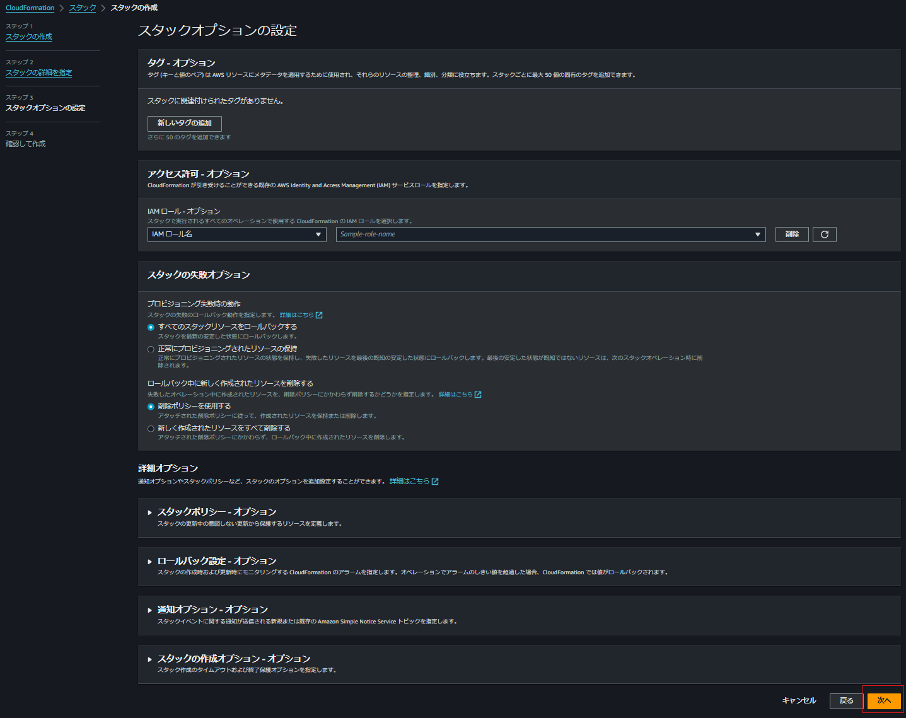
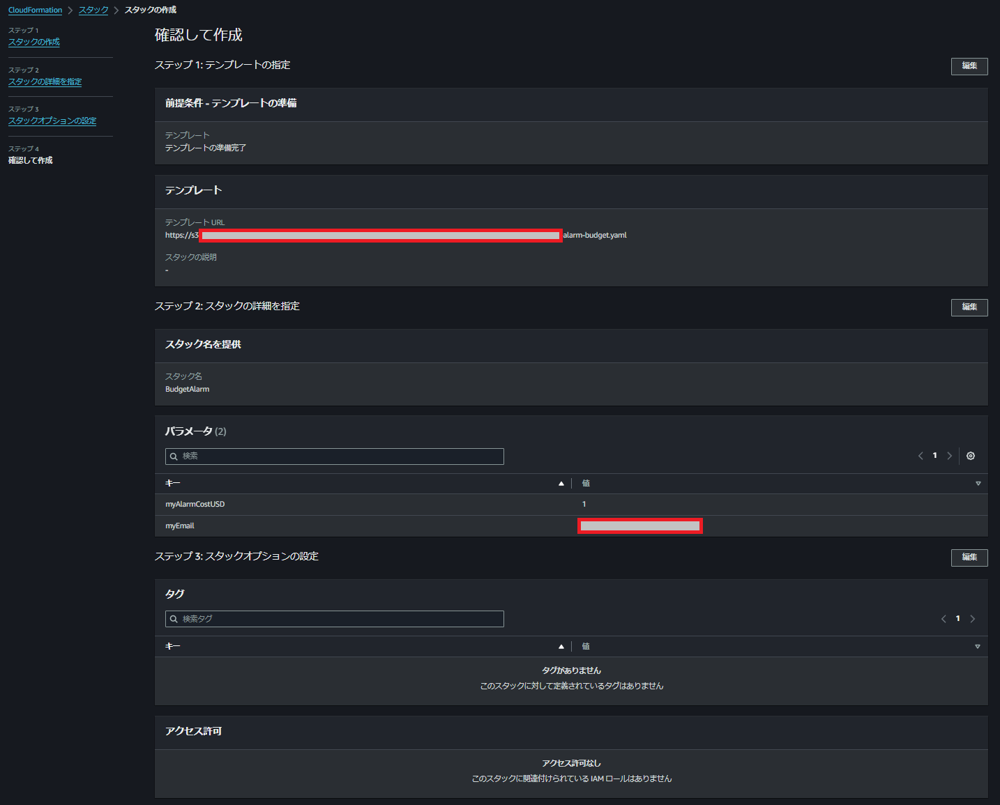

# AWSの予算超過時の通知設定
- 概要：
CloudFormation（AWSマネージドのIaCサービス）を使用してBudget（AWSリソースのコスト管理サービス）の設定を行う

## 1. テンプレートファイルをローカルにダウンロード
[Github](https://github.com/kazucch0925/cloudformation_test)から「alarm-budget.yaml」か「alarm-and-stopInstances-budget.yaml」をローカルにダウンロード
> [!NOTE]
> - どちらを使うかは以下を参考に各自の用途に合わせる
> - 共通 : 予測値や実コストがしきい値を超えそう、または超えたタイミングでメールで通知
>   - alarm-budget.yaml : メールでの通知のみ
>   - alarm-and-stopInstances-budget.yaml : メールでの通知 + リージョン内で起動中の全てのEC2インスタンスを停止（終了ではないためインスタンス自体は残る）

## 2. CloudFormationの設定
1. AWSマネジメントコンソールにログインし、CloudFormationの画面を開く
2. 「スタックの作成」押下
3. **スタックの作成**で以下の通り設定  
①テンプレートの種類：既存のテンプレートを選択  
②テンプレートソース：テンプレートファイルのアップロード  
③「ファイルの選択」でダウンロードしたyamlファイルを選択  
④「次へ」押下  

4. **スタックの詳細を指定**で以下の通り設定  
①スタック名：自由に設定  
②myEmail：通知を受け取りたいメールアドレスを指定  
③「次へ」押下  

> [!note]
> - テンプレでは「基準値の何割超過したか」を判定条件としており、myAlarmCostUSDはその基準値となる値（デフォルトは1 USD）  
> - テンプレで指定している割合は以下3通り
※カッコ内は、基準値を1 USDとした場合のしきい値）  
>   - 0.1%（0.001 USD）  
>   - 50%（0.50 USD）  
>   - 100%（1.00 USD）  

5. **スタックオプションの設定**はどこも触らず「次へ」押下

6. **確認して作成**で設定を確認し、「送信」押下

> [!TIPS]
> - 「alarm-and-stopInstances-budget.yaml」のテンプレ内でIAMリソースの作成を行っている。そのため、上記テンプレを使用する場合はこのタイミングでIAMリソース作成の許可を求められますが、インスタンス停止に必要最低限の権限に絞ってあるため安心してチェックを入れてください
> 

7. スタックが「**CREATE_COMPLETE**」になるまでしばらく待機

## 3. 設定内容の確認

1. 作成済みのスタックの**①リソース**タブを押下し**②物理ID**のリンクを押下

2. Budgetの画面に飛ぶので「アラート」タブを押下し、作成された通知設定の内容を確認
